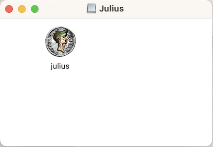

 

Ansible Role Caesar 3
---------------------

Ansible Role Caesar 3 is a Ansible role for provisioning [Julius](https://github.com/bvschaik/julius), which is used for playing [Caesar III city-building game](https://en.wikipedia.org/wiki/Caesar_III).

Julius requires the files from the original game:

    Julius will not run without the original Caesar 3 files. You can buy a digital copy from GOG or Steam, or you can use an original CD-ROM version.

Ansible Role Caesar 3 currently only supports GOG offline backup game installer on macOS.

Installation
------------

Add the role to Ansible `requirements.yml` .

From Ansible Galaxy:

    roles:

      - src: cliffano.caesar3
        path: roles/

Or direct from Github:

    roles:

      - src: https://github.com/cliffano/ansible-role-caesar3
        path: roles/

The download GOG offline backup game installer - Read [FAQ](#faq) for further info on the installer

Usage
-----

Add the role to playbook:

    - hosts: all

      vars:
        c3_gog_setup_version: '3_1.0.1.0_(76354)'
        c3_gog_setup_dir: /tmp
        c3_install_dir: /opt/caesar3
        c3_julius_app_version: '1.7.0'

      roles:
        - cliffano.caesar3

Or alternatively, as a task using import role:

      tasks:

        - ansible.builtin.import_role:
            name: cliffano.caesar3
          vars:
            c3_gog_setup_version: '3_1.0.1.0_(76354)'
            c3_gog_setup_dir: /tmp
            c3_install_dir: /opt/caesar3
            c3_julius_app_version: '1.7.0'

After the task is executed, the provisioned Caesar 3 directory will look like this:

    /opt/caesar3
    /opt/caesar3/bin
    /opt/caesar3/bin/julius-1.7.0-mac.dmg
    /opt/caesar3/julius-app
    /opt/caesar3/julius-app/... (Caesar 3 game files)

Double click on the DMG file, and then on the Julius coin icon:

When prompted for Caesar 3 folder, navigate to the `julius-app` directory, and click the `Choose` button:

Config
------

| Variable | Description | Default |
|----------|-------------|---------|
| c3_gog_setup_version | Version of GOG offline backup game installer, read [FAQ](#faq) for further info on the installer | 3_1.0.1.0_(76354) |
| c3_gog_setup_dir | Directory where GOG offline backup game installer is located | /tmp |
| c3_install_dir | Directory where Caesar 3 game resources will be located | /opt/caesar3 |
| c3_julius_app_version | Version of Julius, available on [Julius Releases](https://github.com/bvschaik/julius/releases) page | '1.7.0' |
| c3_julius_app_dir_mode | Mode of Julius app directory, read [FAQ](#faq) if you have a problem with saving the game | '0755' |

FAQ
---

*Where can I get the GOG offline backup game installer?*

If you purchased the original game from GOG, you cannot directly download the installer from [GOG's Caesar 3 game page](https://www.gog.com/en/game/caesar_3). And instead, you have to visit your GOG library, then click Caesar 3 from `My Collection` section. It will show Caesar 3 resources like this [screenshot](screenshots/gog-library.png). You can then download the offline backup game installer at the bottom of the Caesar III . This installer has the name pattern `setup_caesartm_<version>.exe` .

*Why can't the non-admin users save the game?*

If you're a non-admin user and the game was installed by an admin user, then this problem is caused by the fact that julius-app directory was created with mode 0755 which allows the non-admin user to read the game files but not write any game file. You can change the mode to another value which give the non-admin user permission to write the game files.

